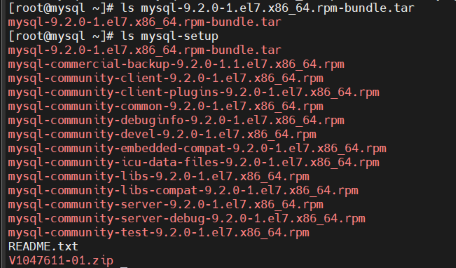
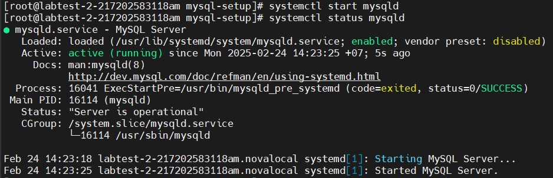

### MySQL
>MySQL là một hệ quản trị cơ sở dữ liệu quan hệ (RDBMS - Relational Database Management System) mã nguồn mở phổ biến, được phát triển bởi công ty MySQL AB và hiện thuộc sở hữu của Oracle Corporation. MySQL sử dụng ngôn ngữ SQL (Structured Query Language) để quản lý, truy vấn và thao tác dữ liệu.

#### Cài đặt MySql trên máy chủ Oracle Linux 7.9
- Cài đặt bằng gói có sẵn trên kho lưu trữ của hệ điều hành hoặc kho chính thức của MySql
  ```bash
  sudo yum update 
  sudo yum install mysql-server -y
  sudo systemctl start mysqld
  sudo systemctl enable mysqld
  ```
- Cài đặt thủ công bằng bản nén
    - Tải gói cài tại trang: https://dev.mysql.com/downloads/mysql/
           <div align="center">
          
        </div>
    - Upload file cài đặt lên máy chủ
    
        ```bash
              scp "/mnt/c/Users/Lenovo iDeapad/Downloads/mysql-9.2.0-1.el7.x86_64.rpm-bundle.tar" root@14.225.69.27:/root/
        ```
         <div align="center">
          
        </div>
    - Kiểm tra file đã tồn tại và giải nén 
    
        ```javascript
          ls -l /root/mysql-9.2.0-1.el7.x86_64.rpm-bundle.tar
      
            // Tạo thư mục chứa
                 mkdir mysql-setup
            
            // Di chuyển file vào thư mục
                 mv mysql-9.2.0-1.el7.x86_64.rpm-bundle.tar mysql-setup
            
            // Vào thư mục, giải nén
                cd mysql-setup
                tar -xvf mysql-9.2.0-1.el7.x86_64.rpm-bundle.tar
            
            // Cài đặt các gói cần thiết
                yum install -y perl-Data-Dumper libaio
            
            // Cài đặt lần lượt các tệp
            rpm -Uvh mysql-community-common-9.2.0-1.el7.x86_64.rpm
            rpm -Uvh mysql-community-icu-data-files-9.2.0-1.el7.x86_64.rpm
            rpm -Uvh mysql-community-client-plugins-9.2.0-1.el7.x86_64.rpm
            rpm -Uvh mysql-community-libs-*
            rpm -Uvh mysql-community-client-9.2.0-1.el7.x86_64.rpm
            rpm -Uvh mysql-community-server-9.2.0-1.el7.x86_64.rpm
         ```
  - Kết quả: 
<div align="center">
  
</div>

- Khi MySQL được khởi động lần đầu tiên, một mật khẩu ngẫu nhiên sẽ được tạo ra cho root, là user quản trị của MySQL. Thấy mật khẩu bằng cách chạy lệnh sau: `cat /var/log/mysqld.log | grep password`
    <div align="center">
      
    </div>
- Đổi mật khẩu: `mysql_secure_installation`

- Kết nối vào MySQL `mysql -u root -p`
  <div align="center">
    
  </div>
