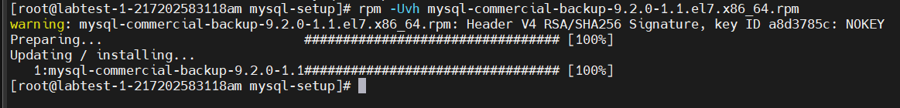

### MySqlBackup
> - MySQL Community có 1 hạn chế là chỉ có 1 công cụ backup là mysqldump. Công cụ này thì chỉ backup database ở cấp độ logical (backup database ra thành 1 file có nội dung là các câu lệnh SQL để khôi phục lại nguyên trạng database). Nó không có các tùy chọn backup như incremental hay apply binlog.
> - Tuy nhiên, ở phiên bản MySQL Enterprise lại có công cụ mysqlbackup có thể đáp ứng các nhu cầu backup database của DBA. Công cụ này cho phép download và sử dụng được cho bản Community.

- Tải file cài đặt từ trang https://edelivery.oracle.com
  - Tìm kiếm từ khóa **MySQL Enterprise Backup** và chọn **Add**
    <div align="center">
     
    </div>
  -  Tại mục **Continue** chọn hệ điều hành máy chủ
     <div align="center">
     
      </div>    
  - Chọn phiên bản và tải xuống
    <div align="center">
     
    </div>
- Upload file cài đặt lên máy chủ
    
   ```bash
       scp "/mnt/c/Users/Lenovo iDeapad/Downloads/V1047861-01.zip" root@14.225.69.27:/root/
   ```
   <div align="center">
     
    </div>
- Giải nén và khởi chạy
   ```bash
  * Giải nén: unzip V1047611-01.zip
  * Install: [root@labmysql ~]# rpm -Uvh mysql-commercial-backup-9.2.0-1.1.el7.x86_64.rpm  
  			Preparing...                          ################################# [100%]
  			Updating / installing...
  			   1:mysql-commercial-backup-8.4.4-1.1################################# [100%]
   ```
     <div align="center">
     
    </div>
___
### Backup MySQL với Mysqlbackup
#### 1. Backup Full
  ```bash
  	mysqlbackup --port=3306 --protocol=tcp --user=root --password=123123aA@ --with-timestamp --backup-dir=/backup/full backup
  ```
  - Ý nghĩa các tham số:

  	– port: Chỉ ra port mà MySQL đang sử dụng.
  
  	– protocol: Chỉ ra giao thức mà MySQL đang sử dụng.
  
  	– user: User sử dụng để backup (có thể là root)
  
  	– password: Mật khẩu của user backup.
  
  	– backup-dir: Chỉ ra đường dẫn đến thư mục lưu bản backup
  
  	– with-timestamp: Tạo ra thư mục lưu bản backup với tên là thời gian bản backup được tạo ra
  - Kết quả
    ```bash

    [root@labtest-1-217202583118am mysql-setup]# mysqlbackup --port=3306 --protocol=tcp --user=root --password=123123aA@ --with-timestamp --backup-dir=/backup/full backup
    MySQL Enterprise Backup  Ver 9.2.0-commercial for Linux on x86_64 (MySQL Enterprise - Commercial)
    Copyright (c) 2003, 2025, Oracle and/or its affiliates.
    
    Oracle is a registered trademark of Oracle Corporation and/or its
    affiliates. Other names may be trademarks of their respective
    owners.
    
    Starting with following command line ...
    mysqlbackup
    --port=3306
    --protocol=tcp
    --user=root
    --password=xxxxxxxxx
    --with-timestamp
    --backup-dir=/backup/full
    backup
    
    IMPORTANT: Please check that mysqlbackup run completes successfully.
               At the end of a successful 'backup' run mysqlbackup
               prints "mysqlbackup completed OK!".
    
    250224 13:56:41 MAIN     INFO: Establishing connection to server.
    250224 13:56:41 MAIN     INFO: SSL: attempting to use an SSL connection.
    250224 13:56:41 MAIN     INFO: MySQL server version is '9.2.0'
    250224 13:56:41 MAIN     INFO: MySQL server compile os version is 'Linux'
    250224 13:56:41 MAIN     INFO: SSL/TLS version used for connection is TLSv1.2
    250224 13:56:41 MAIN     INFO: Got some server configuration information from running server.
    
    250224 13:56:41 MAIN     INFO: Establishing connection to server for locking.
    250224 13:56:41 MAIN     INFO: SSL: attempting to use an SSL connection.
    250224 13:56:41 MAIN     INFO: Backup directory created: '/backup/full/2025-02-24_13-56-41'
    250224 13:56:41 MAIN     INFO: MySQL server version_comment is 'MySQL Community Server - GPL'
    250224 13:56:41 MAIN     INFO: Mysqlbackup component not installed.
    250224 13:56:41 MAIN     INFO: MEB logfile created at /backup/full/2025-02-24_13-56-41/meta/MEB_2025-02-24.13-56-41_backup.log
    
    250224 13:56:41 MAIN     INFO: The MySQL server has no active keyring.
    --------------------------------------------------------------------
                           Server Repository Options:
    --------------------------------------------------------------------
      datadir                        = /var/lib/mysql/
      innodb_data_home_dir           =
      innodb_data_file_path          = ibdata1:12M:autoextend
      innodb_log_group_home_dir      = /var/lib/mysql/
      innodb_undo_directory          = /var/lib/mysql/
      innodb_undo_tablespaces        = 2
      innodb_buffer_pool_filename    = ib_buffer_pool
      innodb_page_size               = 16384
      innodb_checksum_algorithm      = crc32
    
    --------------------------------------------------------------------
                           Backup Config Options:
    --------------------------------------------------------------------
      datadir                        = /backup/full/2025-02-24_13-56-41/datadir
      innodb_data_home_dir           = /backup/full/2025-02-24_13-56-41/datadir
      innodb_data_file_path          = ibdata1:12M:autoextend
      innodb_log_group_home_dir      = /backup/full/2025-02-24_13-56-41/datadir
      innodb_undo_directory          = /backup/full/2025-02-24_13-56-41/datadir
      innodb_undo_tablespaces        = 2
      innodb_buffer_pool_filename    = ib_buffer_pool
      innodb_page_size               = 16384
      innodb_checksum_algorithm      = crc32
    
    250224 13:56:41 MAIN     INFO: Unique generated backup id for this is 17403802015622780
    
    250224 13:56:41 MAIN     INFO: Copying the server config file '/var/lib/mysql/auto.cnf'
    250224 13:56:41 MAIN     INFO: Testing, if we can reach zero temporary replica tables within the configured timeout of 300 seconds.
    250224 13:56:41 MAIN     INFO: Reached zero temporary replica tables.
    250224 13:56:41 MAIN     INFO: Creating 14 buffers each of size 16777216.
    250224 13:56:41 MAIN     INFO: The server is not configured for redo log archiving. The system variable innodb_redo_log_archive_dirs is not set.
    250224 13:56:41 MAIN     INFO: Found checkpoint at lsn 19786491.
    250224 13:56:41 MAIN     INFO: Starting log scan from lsn = 19786240 at offset = 131835 and checkpoint = 19786491 in file /var/lib/mysql/#innodb_redo/#ib_redo6.
    250224 13:56:41 MAIN     INFO: Full Backup operation starts with following threads
                                   1 read-threads    6 process-threads    1 write-threads
    250224 13:56:41 MAIN     INFO: Starting to copy all innodb files...
    250224 13:56:41 RDR1     INFO: Copying /var/lib/mysql/ibdata1.
    250224 13:56:41 RLP1     INFO: Starting to parse redo log at lsn = 19786330, whereas checkpoint_lsn = 19786491 and start_lsn = 19786240.
    250224 13:56:41 RDR1     INFO: Starting to copy all undo files...
    250224 13:56:41 RDR1     INFO: Copying /var/lib/mysql/undo_002.
    250224 13:56:41 RDR1     INFO: Copying /var/lib/mysql/undo_001.
    250224 13:56:41 RDR1     INFO: Starting to lock instance for backup...
    250224 13:56:41 RDR1     INFO: The server instance is locked for backup.
    250224 13:56:41 RDR1     INFO: The server instance is unlocked after 0.002 seconds.
    250224 13:56:41 RDR1     INFO: Copying /var/lib/mysql/sys/sys_config.ibd.
    250224 13:56:41 RDR1     INFO: Copying /var/lib/mysql/test/test_table.ibd.
    250224 13:56:41 RDR1     INFO: Copying /var/lib/mysql/test1/chungloaithietbi.ibd.
    250224 13:56:41 RDR1     INFO: Copying /var/lib/mysql/test1/hangcungcap.ibd.
    250224 13:56:41 RDR1     INFO: Copying /var/lib/mysql/test1/nguoiquantri.ibd.
    250224 13:56:41 RDR1     INFO: Copying /var/lib/mysql/mysql/backup_progress.ibd.
    250224 13:56:41 RDR1     INFO: Copying /var/lib/mysql/mysql.ibd.
    250224 13:56:41 RDR1     INFO: Completing the copy of innodb files.
    250224 13:56:41 RDR1     INFO: Requesting a dump of the InnoDB buffer pool
    250224 13:56:41 RDR1     INFO: Waiting for the dump of the InnoDB buffer pool to complete
    250224 13:56:42 RDR1     INFO: The dump of the InnoDB buffer pool completed
    250224 13:56:42 RDR1     INFO: Binary Log Basename: '/var/lib/mysql/binlog'
    250224 13:56:42 RDR1     INFO: Binary Log Index:    '/var/lib/mysql/binlog.index'
    250224 13:56:42 RDR1     INFO: Relay Channel:      ''
    250224 13:56:42 RDR1     INFO: Relay Log Basename: '/var/lib/mysql/labtest-1-217202583118am-relay-bin'
    250224 13:56:42 RDR1     INFO: Relay Log Index:    '/var/lib/mysql/labtest-1-217202583118am-relay-bin.index'
    250224 13:56:42 RDR1     INFO: Relay Channel:      'group_replication_applier'
    250224 13:56:42 RDR1     INFO: Relay Log Basename: '/var/lib/mysql/labtest-1-217202583118am-relay-bin-group_replication_applier'
    250224 13:56:42 RDR1     INFO: Relay Channel:      'group_replication_recovery'
    250224 13:56:42 RDR1     INFO: Relay Log Basename: '/var/lib/mysql/labtest-1-217202583118am-relay-bin-group_replication_recovery'
    250224 13:56:42 RDR1     INFO: Starting to copy Binlog files.
    250224 13:56:42 RDR1     INFO: Copying /var/lib/mysql/binlog.000001.
    250224 13:56:42 RDR1     INFO: Copying /var/lib/mysql/binlog.000002.
    250224 13:56:42 RDR1     INFO: Copying /var/lib/mysql/binlog.000003.
    250224 13:56:42 RDR1     INFO: Copying /var/lib/mysql/labtest-1-217202583118am-relay-bin.000001.
    250224 13:56:42 RDR1     INFO: Stopped replica SQL thread and have zero temporary replica tables.
    250224 13:56:42 RDR1     INFO: Starting to lock instance for backup...
    250224 13:56:42 RDR1     INFO: The server instance is locked for backup.
    250224 13:56:42 RDR1     INFO: The MySQL server has no active keyring.
    250224 13:56:42 RDR1     INFO: Requesting flush of redo log reading after LSN 19857280.
    250224 13:56:42 RDR1     INFO: Requesting flush of redo log processing after LSN 19857280.
    250224 13:56:42 RDR1     INFO: Completed flush of redo log reading after LSN 19857280.
    250224 13:56:42 RDR1     INFO: Completed flush of redo log processing after LSN 19857280.
    250224 13:56:42 RDR1     INFO: Starting to read-lock tables...
    250224 13:56:42 RDR1     INFO: No tables to read-lock.
    250224 13:56:42 RDR1     INFO: Opening backup source directory '/var/lib/mysql'
    250224 13:56:42 RDR1     INFO: Starting to copy non-innodb files in subdirs of '/var/lib/mysql'
    250224 13:56:42 RDR1     INFO: Copying the database directory 'mysql'
    250224 13:56:42 RDR1     INFO: Copying the database directory 'performance_schema'
    250224 13:56:42 RDR1     INFO: Copying the database directory 'sys'
    250224 13:56:42 RDR1     INFO: Copying the database directory 'test'
    250224 13:56:42 RDR1     INFO: Copying the database directory 'test1'
    250224 13:56:42 RDR1     INFO: Copying the database directory 'testReplica'
    250224 13:56:42 RDR1     INFO: Completing the copy of all non-innodb files.
    250224 13:56:42 RDR1     INFO: Requesting consistency information...
    250224 13:56:42 RDR1     INFO: Locked the consistency point for 2052 microseconds.
    250224 13:56:42 RDR1     INFO: Consistency point server_uuid '8bb7c95b-ef31-11ef-8616-fa163ece6658'.
    250224 13:56:42 RDR1     INFO: Consistency point gtid_executed ''.
    250224 13:56:42 RDR1     INFO: Consistency point binary_log_file 'binlog.000004'.
    250224 13:56:42 RDR1     INFO: Consistency point binary_log_position 94169.
    250224 13:56:42 RDR1     INFO: Consistency point replication channel '':
    250224 13:56:42 RDR1     INFO: Consistency point relay_log_file 'labtest-1-217202583118am-relay-bin.000002':
    250224 13:56:42 RDR1     INFO: Consistency point relay_log_position 94305.
    250224 13:56:42 RDR1     INFO: Consistency point InnoDB lsn 19858040.
    250224 13:56:42 RDR1     INFO: Consistency point InnoDB lsn_checkpoint 19786491.
    250224 13:56:42 RDR1     INFO: Requesting completion of redo log copy after LSN 19858040.
    250224 13:56:42 RLW1     INFO: A copied database page was modified at 19850979. (This is the highest lsn found on a page)
    250224 13:56:42 RLW1     INFO: Scanned log up to lsn 19858040.
    250224 13:56:42 RLW1     INFO: Was able to parse the log up to lsn 19858040.
    250224 13:56:42 RLW1     INFO: Copied redo log
                                   log_start_lsn    19786240
                                   start_checkpoint 19786491
                                   start_lsn        19786491
                                   last_checkpoint  19786491
                                   consistency_lsn  19858040
                                   log_end_lsn      19858040
    250224 13:56:42 RLR1     INFO: Redo log reader waited 51 times for a total of 255.00 ms for logs to generate.
    250224 13:56:42 RDR1     INFO: Truncating binary log index '/backup/full/2025-02-24_13-56-41/datadir/binlog.index' to 64.
    250224 13:56:42 RDR1     INFO: Truncating binary log 'binlog.000004' to 94169.
    250224 13:56:42 RDR1     INFO: Copying /var/lib/mysql/binlog.000004.
    250224 13:56:42 RDR1     INFO: Truncating binary log index '/backup/full/2025-02-24_13-56-41/datadir/labtest-1-217202583118am-relay-bin.index' to 88.
    250224 13:56:42 RDR1     INFO: Truncating binary log 'labtest-1-217202583118am-relay-bin.000002' to 94305.
    250224 13:56:42 RDR1     INFO: Copying /var/lib/mysql/labtest-1-217202583118am-relay-bin.000002.
    250224 13:56:42 RDR1     INFO: Completed the copy of binlog files...
    250224 13:56:42 RDR1     INFO: The server instance is unlocked after 0.062 seconds.
    250224 13:56:42 RDR1     INFO: Reading all global variables from the server.
    250224 13:56:42 RDR1     INFO: Completed reading of all 635 global variables from the server.
    250224 13:56:42 RDR1     INFO: Writing server defaults files 'server-my.cnf' and 'server-all.cnf' for server '9.2.0' in '/backup/full/2025-02-24_13-56-41'.
    250224 13:56:42 MAIN     INFO: Full Backup operation completed successfully.
    250224 13:56:42 MAIN     INFO: Backup created in directory '/backup/full/2025-02-24_13-56-41'.
    250224 13:56:42 MAIN     INFO: MySQL binlog position: filename binlog.000004, position 94169.
    
    -------------------------------------------------------------
       Parameters Summary
    -------------------------------------------------------------
       Start LSN                  : 19786240
       Last Checkpoint LSN        : 19786491
       End LSN                    : 19858040
    -------------------------------------------------------------
    
    mysqlbackup completed OK!

    ```

____
####  2. Backup Incremental
```bash
  	mysqlbackup --port=3306 --protocol=tcp --user=root --password=123123aA@ \
  --incremental \
  --incremental-base=dir:/backup/full/2025-02-24_13-56-41/ \
  --incremental-backup-dir=/backup/incremental backup
```
  – defaults-file: Đường dẫn đến file config của MySQL, mặc định là /etc/my.cnf
  
  – incremental-base: Đường dẫn đến bản backup full gần nhất. Bản backup incremental sẽ dựa vào bản backup full này làm cơ sở.
  
  – incremental-backup-dir: Đường dẫn lưu bản backup incremental
- Kết quả
```bash
    [root@labtest-1-217202583118am mysql-setup]#   mysqlbackup --port=3306 --protocol=tcp --user=root --password=123123aA@ \
    >   --incremental \
    >   --incremental-base=dir:/backup/full/2025-02-24_13-56-41/ \
    >   --incremental-backup-dir=/backup/incremental backup
MySQL Enterprise Backup  Ver 9.2.0-commercial for Linux on x86_64 (MySQL Enterprise - Commercial)
Copyright (c) 2003, 2025, Oracle and/or its affiliates.

Oracle is a registered trademark of Oracle Corporation and/or its
affiliates. Other names may be trademarks of their respective
owners.

Starting with following command line ...
mysqlbackup
--port=3306
--protocol=tcp
--user=root
--password=xxxxxxxxx
--incremental
--incremental-base=dir:/backup/full/2025-02-24_13-56-41/
--incremental-backup-dir=/backup/incremental
backup

IMPORTANT: Please check that mysqlbackup run completes successfully.
           At the end of a successful 'backup' run mysqlbackup
           prints "mysqlbackup completed OK!".

250224 14:04:59 MAIN     INFO: Establishing connection to server.
250224 14:04:59 MAIN     INFO: SSL: attempting to use an SSL connection.
250224 14:04:59 MAIN     INFO: MySQL server version is '9.2.0'
250224 14:04:59 MAIN     INFO: MySQL server compile os version is 'Linux'
250224 14:04:59 MAIN     INFO: SSL/TLS version used for connection is TLSv1.2
250224 14:04:59 MAIN     INFO: Got some server configuration information from running server.

250224 14:04:59 MAIN     INFO: Establishing connection to server for locking.
250224 14:04:59 MAIN     INFO: SSL: attempting to use an SSL connection.
250224 14:04:59 MAIN     INFO: Backup directory created: '/backup/incremental'
250224 14:04:59 MAIN     INFO: MySQL server version_comment is 'MySQL Community Server - GPL'
250224 14:04:59 MAIN     INFO: Mysqlbackup component not installed.
250224 14:04:59 MAIN     INFO: read_backup_variables_txt_file: '/backup/full/2025-02-24_13-56-41/meta/backup_variables.txt'
250224 14:04:59 MAIN     INFO: backup variable mysql_version=9.2.0
250224 14:04:59 MAIN     INFO: MySQL server version is '9.2.0'
250224 14:04:59 MAIN     INFO: Restoring ...9.2.0 version
250224 14:04:59 MAIN     INFO: backup variable meb_version=9.2.0
250224 14:04:59 MAIN     INFO: backup variable start_lsn=19786240
250224 14:04:59 MAIN     INFO: backup variable last_checkpoint=19786491
250224 14:04:59 MAIN     INFO: backup variable end_lsn=19858040
250224 14:04:59 MAIN     INFO: backup variable apply_log_done=0
250224 14:04:59 MAIN     INFO: backup variable is_incremental=0
250224 14:04:59 MAIN     INFO: backup variable is_incremental_with_redo_log_only=0
250224 14:04:59 MAIN     INFO: backup variable is_partial=0
250224 14:04:59 MAIN     INFO: backup variable is_compressed=0
250224 14:04:59 MAIN     INFO: backup variable is_skip_binlog=0
250224 14:04:59 MAIN     INFO: backup variable is_skip_relaylog=0
250224 14:04:59 MAIN     INFO: backup variable is_skip_unused_pages=0
250224 14:04:59 MAIN     INFO: backup variable is_onlyinnodb=0
250224 14:04:59 MAIN     INFO: backup variable binlog_position=binlog.000004:94169
250224 14:04:59 MAIN     INFO: backup variable binlog_index=binlog.index
250224 14:04:59 MAIN     INFO: backup variable relaylog_channels=
250224 14:04:59 MAIN     INFO: backup variable relaylog_index=labtest-1-217202583118am-relay-bin.index
250224 14:04:59 MAIN     INFO: backup variable has_tde_tables=0
250224 14:04:59 MAIN     INFO: backup variable start_time_utc=1740380201537457
250224 14:04:59 MAIN     INFO: backup variable end_time_utc=1740380202119383
250224 14:04:59 MAIN     INFO: backup variable consistency_time_utc=1740380202072870
250224 14:04:59 MAIN     INFO: backup variable mysql_version_comment=MySQL Community Server - GPL
250224 14:04:59 MAIN     INFO: backup variable log_bin_name=binlog
250224 14:04:59 MAIN     INFO: backup variable relay_log_name=labtest-1-217202583118am-relay-bin
250224 14:04:59 MAIN     INFO: backup variable relay_index_name_prefix=labtest-1-217202583118am-relay-bin
250224 14:04:59 MAIN     INFO: backup variable log_bin_index_name=binlog
250224 14:04:59 MAIN     INFO: backup variable innodb_undo_files_count=2
250224 14:04:59 MAIN     INFO: Using start_lsn=19858040, calculated from backup_variables.txt file of incremental-base backup.
250224 14:04:59 MAIN     INFO: Using "full-scan" algorithm for this incremental backup.
250224 14:04:59 MAIN     INFO: MEB logfile created at /backup/incremental/meta/MEB_2025-02-24.14-04-59_backup.log

250224 14:04:59 MAIN     INFO: The MySQL server has no active keyring.
--------------------------------------------------------------------
                       Server Repository Options:
--------------------------------------------------------------------
  datadir                        = /var/lib/mysql/
  innodb_data_home_dir           =
  innodb_data_file_path          = ibdata1:12M:autoextend
  innodb_log_group_home_dir      = /var/lib/mysql/
  innodb_undo_directory          = /var/lib/mysql/
  innodb_undo_tablespaces        = 2
  innodb_buffer_pool_filename    = ib_buffer_pool
  innodb_page_size               = 16384
  innodb_checksum_algorithm      = crc32

--------------------------------------------------------------------
                       Backup Config Options:
--------------------------------------------------------------------
  datadir                        = /backup/incremental/datadir
  innodb_data_home_dir           = /backup/incremental/datadir
  innodb_data_file_path          = ibdata1:12M:autoextend
  innodb_log_group_home_dir      = /backup/incremental/datadir
  innodb_undo_directory          = /backup/incremental/datadir
  innodb_undo_tablespaces        = 2
  innodb_buffer_pool_filename    = ib_buffer_pool
  innodb_page_size               = 16384
  innodb_checksum_algorithm      = crc32

250224 14:04:59 MAIN     INFO: Unique generated backup id for this is 17403806995633699

250224 14:04:59 MAIN     INFO: Copying the server config file '/var/lib/mysql/auto.cnf'
250224 14:04:59 MAIN     INFO: Testing, if we can reach zero temporary replica tables within the configured timeout of 300 seconds.
250224 14:04:59 MAIN     INFO: Reached zero temporary replica tables.
250224 14:04:59 MAIN     INFO: Creating 14 buffers each of size 17301504.
250224 14:04:59 MAIN     INFO: The server is not configured for redo log archiving. The system variable innodb_redo_log_archive_dirs is not set.
250224 14:04:59 MAIN     INFO: Found checkpoint at lsn 20009338.
250224 14:04:59 MAIN     INFO: Starting log scan from lsn = 20008960 at offset = 354682 and checkpoint = 20009338 in file /var/lib/mysql/#innodb_redo/#ib_redo6.
250224 14:04:59 MAIN     INFO: Incremental Backup operation starts with following threads
                               1 read-threads    6 process-threads    1 write-threads
250224 14:04:59 MAIN     INFO: Starting to copy all innodb files...
250224 14:04:59 RDR1     INFO: Checking on /var/lib/mysql/ibdata1.
250224 14:04:59 RLP1     INFO: Starting to parse redo log at lsn = 20008996, whereas checkpoint_lsn = 20009338 and start_lsn = 20008960.
250224 14:04:59 RDR1     INFO: Starting to copy all undo files...
250224 14:04:59 RDR1     INFO: Copying /var/lib/mysql/undo_002.
250224 14:04:59 RDR1     INFO: Copying /var/lib/mysql/undo_001.
250224 14:04:59 RDR1     INFO: Starting to lock instance for backup...
250224 14:04:59 RDR1     INFO: The server instance is locked for backup.
250224 14:04:59 RDR1     INFO: The server instance is unlocked after 0.002 seconds.
250224 14:04:59 RDR1     INFO: Checking on /var/lib/mysql/sys/sys_config.ibd.
250224 14:04:59 RDR1     INFO: Checking on /var/lib/mysql/test/test_table.ibd.
250224 14:04:59 RDR1     INFO: Checking on /var/lib/mysql/test1/chungloaithietbi.ibd.
250224 14:04:59 RDR1     INFO: Checking on /var/lib/mysql/test1/hangcungcap.ibd.
250224 14:04:59 RDR1     INFO: Checking on /var/lib/mysql/test1/nguoiquantri.ibd.
250224 14:04:59 RDR1     INFO: Checking on /var/lib/mysql/mysql/backup_progress.ibd.
250224 14:04:59 RDR1     INFO: Checking on /var/lib/mysql/mysql/backup_history.ibd.
250224 14:04:59 RDR1     INFO: Checking on /var/lib/mysql/mysql.ibd.
250224 14:04:59 RDR1     INFO: Completing the copy of innodb files.
250224 14:04:59 RDR1     INFO: Requesting a dump of the InnoDB buffer pool
250224 14:04:59 RDR1     INFO: Waiting for the dump of the InnoDB buffer pool to complete
250224 14:04:59 RDR1     INFO: The dump of the InnoDB buffer pool completed
250224 14:04:59 RDR1     INFO: Binary Log Basename: '/var/lib/mysql/binlog'
250224 14:04:59 RDR1     INFO: Binary Log Index:    '/var/lib/mysql/binlog.index'
250224 14:04:59 RDR1     INFO: Relay Channel:      ''
250224 14:04:59 RDR1     INFO: Relay Log Basename: '/var/lib/mysql/labtest-1-217202583118am-relay-bin'
250224 14:04:59 RDR1     INFO: Relay Log Index:    '/var/lib/mysql/labtest-1-217202583118am-relay-bin.index'
250224 14:04:59 RDR1     INFO: Relay Channel:      'group_replication_applier'
250224 14:04:59 RDR1     INFO: Relay Log Basename: '/var/lib/mysql/labtest-1-217202583118am-relay-bin-group_replication_applier'
250224 14:04:59 RDR1     INFO: Relay Channel:      'group_replication_recovery'
250224 14:04:59 RDR1     INFO: Relay Log Basename: '/var/lib/mysql/labtest-1-217202583118am-relay-bin-group_replication_recovery'
250224 14:04:59 RDR1     INFO: Starting to copy Binlog files.
250224 14:04:59 RDR1     INFO: Copying /var/lib/mysql/labtest-1-217202583118am-relay-bin.000001.
250224 14:04:59 RDR1     INFO: Stopped replica SQL thread and have zero temporary replica tables.
250224 14:04:59 RDR1     INFO: Starting to lock instance for backup...
250224 14:04:59 RDR1     INFO: The server instance is locked for backup.
250224 14:04:59 RDR1     INFO: The MySQL server has no active keyring.
250224 14:04:59 RDR1     INFO: Requesting flush of redo log reading after LSN 20015450.
250224 14:04:59 RDR1     INFO: Requesting flush of redo log processing after LSN 20015450.
250224 14:04:59 RDR1     INFO: Completed flush of redo log reading after LSN 20015898.
250224 14:04:59 RDR1     INFO: Completed flush of redo log processing after LSN 20015898.
250224 14:04:59 RDR1     INFO: Starting to read-lock tables...
250224 14:04:59 RDR1     INFO: No tables to read-lock.
250224 14:04:59 RDR1     INFO: Opening backup source directory '/var/lib/mysql'
250224 14:04:59 RDR1     INFO: Starting to copy non-innodb files in subdirs of '/var/lib/mysql'
250224 14:04:59 RDR1     INFO: Copying the database directory 'mysql'
250224 14:04:59 RDR1     INFO: Copying the database directory 'performance_schema'
250224 14:04:59 RDR1     INFO: Copying the database directory 'sys'
250224 14:04:59 RDR1     INFO: Copying the database directory 'test'
250224 14:04:59 RDR1     INFO: Copying the database directory 'test1'
250224 14:04:59 RDR1     INFO: Copying the database directory 'testReplica'
250224 14:04:59 RDR1     INFO: Completing the copy of all non-innodb files.
250224 14:04:59 RDR1     INFO: Requesting consistency information...
250224 14:04:59 RDR1     INFO: Locked the consistency point for 414 microseconds.
250224 14:04:59 RDR1     INFO: Consistency point server_uuid '8bb7c95b-ef31-11ef-8616-fa163ece6658'.
250224 14:04:59 RDR1     INFO: Consistency point gtid_executed ''.
250224 14:04:59 RDR1     INFO: Consistency point binary_log_file 'binlog.000004'.
250224 14:04:59 RDR1     INFO: Consistency point binary_log_position 94169.
250224 14:04:59 RDR1     INFO: Consistency point replication channel '':
250224 14:04:59 RDR1     INFO: Consistency point relay_log_file 'labtest-1-217202583118am-relay-bin.000002':
250224 14:04:59 RDR1     INFO: Consistency point relay_log_position 94305.
250224 14:04:59 RDR1     INFO: Consistency point InnoDB lsn 20016357.
250224 14:04:59 RDR1     INFO: Consistency point InnoDB lsn_checkpoint 20009338.
250224 14:04:59 RDR1     INFO: Requesting completion of redo log copy after LSN 20016357.
250224 14:04:59 RLW1     INFO: A copied database page was modified at 20009338. (This is the highest lsn found on a page)
250224 14:04:59 RLW1     INFO: Scanned log up to lsn 20016357.
250224 14:04:59 RLW1     INFO: Was able to parse the log up to lsn 20016357.
250224 14:04:59 RLW1     INFO: Copied redo log
                               log_start_lsn    20008960
                               start_checkpoint 20009338
                               start_lsn        20009338
                               last_checkpoint  20009338
                               consistency_lsn  20016357
                               log_end_lsn      20016357
250224 14:04:59 RLR1     INFO: Redo log reader waited 28 times for a total of 140.00 ms for logs to generate.
250224 14:04:59 RDR1     INFO: Truncating binary log index '/backup/incremental/datadir/binlog.index' to 64.
250224 14:04:59 RDR1     INFO: Truncating binary log 'binlog.000004' to 94169.
250224 14:04:59 RDR1     INFO: Copying /var/lib/mysql/binlog.000004.
250224 14:04:59 RDR1     INFO: Truncating binary log index '/backup/incremental/datadir/labtest-1-217202583118am-relay-bin.index' to 88.
250224 14:04:59 RDR1     INFO: Truncating binary log 'labtest-1-217202583118am-relay-bin.000002' to 94305.
250224 14:04:59 RDR1     INFO: Copying /var/lib/mysql/labtest-1-217202583118am-relay-bin.000002.
250224 14:04:59 RDR1     INFO: Completed the copy of binlog files...
250224 14:04:59 RDR1     INFO: The server instance is unlocked after 0.043 seconds.
250224 14:04:59 RDR1     INFO: Reading all global variables from the server.
250224 14:04:59 RDR1     INFO: Completed reading of all 635 global variables from the server.
250224 14:04:59 RDR1     INFO: Writing server defaults files 'server-my.cnf' and 'server-all.cnf' for server '9.2.0' in '/backup/incremental'.
250224 14:04:59 MAIN     INFO: Incremental Backup operation completed successfully.
250224 14:04:59 MAIN     INFO: Backup created in directory '/backup/incremental'.
250224 14:04:59 MAIN     INFO: Backup contains changes from lsn 19858041 to lsn 20016357.
250224 14:04:59 MAIN     INFO: MySQL binlog position: filename binlog.000004, position 94169.

-------------------------------------------------------------
   Parameters Summary
-------------------------------------------------------------
   Start LSN                  : 19858041
   Last Checkpoint LSN        : 20009338
   End LSN                    : 20016357
-------------------------------------------------------------

mysqlbackup completed OK!

```
___
### Restore MySQL với Mysqlbackup 

- Giả lập tình huống: thư mục data dir của MySQL bị xóa
* Dừng dịch vụ
```bash
[root@labtest-2-217202583118am ~]# systemctl stop  mysqld
```
* Kiểm tra trạng thái
```bash
[root@labtest-2-217202583118am ~]# systemctl status  mysqld
● mysqld.service - MySQL Server
   Loaded: loaded (/usr/lib/systemd/system/mysqld.service; enabled; vendor preset: disabled)
   Active: inactive (dead) since Mon 2025-02-24 15:45:42 +07; 3min 37s ago
     Docs: man:mysqld(8)
           http://dev.mysql.com/doc/refman/en/using-systemd.html
  Process: 17566 ExecStart=/usr/sbin/mysqld $MYSQLD_OPTS (code=exited, status=0/SUCCESS)
  Process: 17492 ExecStartPre=/usr/bin/mysqld_pre_systemd (code=exited, status=0/SUCCESS)
 Main PID: 17566 (code=exited, status=0/SUCCESS)
   Status: "Server shutdown complete (with return value = 0)"

Feb 24 15:42:49 labtest-2-217202583118am.novalocal systemd[1]: Stopped MySQL Server.
Feb 24 15:42:49 labtest-2-217202583118am.novalocal systemd[1]: Starting MySQL Server...
Feb 24 15:42:57 labtest-2-217202583118am.novalocal systemd[1]: Started MySQL Server.
Feb 24 15:45:41 labtest-2-217202583118am.novalocal systemd[1]: Stopping MySQL Server...
Feb 24 15:45:42 labtest-2-217202583118am.novalocal systemd[1]: Stopped MySQL Server.
```

* Xóa thư mục chứa data của MySQL
```bash
[root@labtest-2-217202583118am ~]# rm -rf /var/lib/mysql

```
* Chạy lệch restore sử dụng bản backup full gần nhất
```bash
[root@labtest-2-217202583118am ~]# mysqlbackup --defaults-file=/backup/full/2025-02-24_14-20-33/server-my.cnf --backup-dir=/backup/full/2025-02-24_14-20-33 copy-back-and-apply-log
MySQL Enterprise Backup  Ver 9.2.0-commercial for Linux on x86_64 (MySQL Enterprise - Commercial)
Copyright (c) 2003, 2025, Oracle and/or its affiliates.

Oracle is a registered trademark of Oracle Corporation and/or its
affiliates. Other names may be trademarks of their respective
owners.

Starting with following command line ...
mysqlbackup
--defaults-file=/backup/full/2025-02-24_14-20-33/server-my.cnf
--backup-dir=/backup/full/2025-02-24_14-20-33
copy-back-and-apply-log

IMPORTANT: Please check that mysqlbackup run completes successfully.
           At the end of a successful 'copy-back-and-apply-log' run mysqlbackup
           prints "mysqlbackup completed OK!".

250224 15:49:31 MAIN     INFO: read_backup_variables_txt_file: '/backup/full/2025-02-24_14-20-33/meta/backup_variables.txt'
250224 15:49:31 MAIN     INFO: backup variable mysql_version=9.2.0
250224 15:49:31 MAIN     INFO: MySQL server version is '9.2.0'
250224 15:49:31 MAIN     INFO: Restoring ...9.2.0 version
250224 15:49:31 MAIN     INFO: backup variable meb_version=9.2.0
250224 15:49:31 MAIN     INFO: backup variable start_lsn=19353600
250224 15:49:31 MAIN     INFO: backup variable last_checkpoint=19353909
250224 15:49:31 MAIN     INFO: backup variable end_lsn=19424124
250224 15:49:31 MAIN     INFO: backup variable apply_log_done=0
250224 15:49:31 MAIN     INFO: backup variable is_incremental=0
250224 15:49:31 MAIN     INFO: backup variable is_incremental_with_redo_log_only=0
250224 15:49:31 MAIN     INFO: backup variable is_partial=0
250224 15:49:31 MAIN     INFO: backup variable is_compressed=0
250224 15:49:31 MAIN     INFO: backup variable is_skip_binlog=0
250224 15:49:31 MAIN     INFO: backup variable is_skip_relaylog=0
250224 15:49:31 MAIN     INFO: backup variable is_skip_unused_pages=0
250224 15:49:31 MAIN     INFO: backup variable is_onlyinnodb=0
250224 15:49:31 MAIN     INFO: backup variable binlog_position=binlog.000001:1146
250224 15:49:31 MAIN     INFO: backup variable binlog_index=binlog.index
250224 15:49:31 MAIN     INFO: backup variable has_tde_tables=0
250224 15:49:31 MAIN     INFO: backup variable start_time_utc=1740381633597362
250224 15:49:31 MAIN     INFO: backup variable end_time_utc=1740381634868172
250224 15:49:31 MAIN     INFO: backup variable consistency_time_utc=1740381634441354
250224 15:49:31 MAIN     INFO: backup variable mysql_version_comment=MySQL Community Server - GPL
250224 15:49:31 MAIN     INFO: backup variable log_bin_name=binlog
250224 15:49:31 MAIN     INFO: backup variable log_bin_index_name=binlog
250224 15:49:31 MAIN     INFO: backup variable innodb_undo_files_count=2
250224 15:49:31 MAIN     INFO: read_backup_variables_txt_file: '/backup/full/2025-02-24_14-20-33/meta/backup_variables.txt'
250224 15:49:31 MAIN     INFO: backup variable mysql_version=9.2.0
250224 15:49:31 MAIN     INFO: MySQL server version is '9.2.0'
250224 15:49:31 MAIN     INFO: Restoring ...9.2.0 version
250224 15:49:31 MAIN     INFO: backup variable meb_version=9.2.0
250224 15:49:31 MAIN     INFO: backup variable start_lsn=19353600
250224 15:49:31 MAIN     INFO: backup variable last_checkpoint=19353909
250224 15:49:31 MAIN     INFO: backup variable end_lsn=19424124
250224 15:49:31 MAIN     INFO: backup variable apply_log_done=0
250224 15:49:31 MAIN     INFO: backup variable is_incremental=0
250224 15:49:31 MAIN     INFO: backup variable is_incremental_with_redo_log_only=0
250224 15:49:31 MAIN     INFO: backup variable is_partial=0
250224 15:49:31 MAIN     INFO: backup variable is_compressed=0
250224 15:49:31 MAIN     INFO: backup variable is_skip_binlog=0
250224 15:49:31 MAIN     INFO: backup variable is_skip_relaylog=0
250224 15:49:31 MAIN     INFO: backup variable is_skip_unused_pages=0
250224 15:49:31 MAIN     INFO: backup variable is_onlyinnodb=0
250224 15:49:31 MAIN     INFO: backup variable binlog_position=binlog.000001:1146
250224 15:49:31 MAIN     INFO: backup variable binlog_index=binlog.index
250224 15:49:31 MAIN     INFO: backup variable has_tde_tables=0
250224 15:49:31 MAIN     INFO: backup variable start_time_utc=1740381633597362
250224 15:49:31 MAIN     INFO: backup variable end_time_utc=1740381634868172
250224 15:49:31 MAIN     INFO: backup variable consistency_time_utc=1740381634441354
250224 15:49:31 MAIN     INFO: backup variable mysql_version_comment=MySQL Community Server - GPL
250224 15:49:31 MAIN     INFO: backup variable log_bin_name=binlog
250224 15:49:31 MAIN     INFO: backup variable log_bin_index_name=binlog
250224 15:49:31 MAIN     INFO: backup variable innodb_undo_files_count=2
250224 15:49:31 MAIN  WARNING: If you restore to a server of a different version, the innodb_data_file_path parameter might have a different default. In that case you need to add 'innodb_data_file_path=ibdata1:12M:autoextend' to the target server configuration.
250224 15:49:31 MAIN     INFO: MEB logfile created at /backup/full/2025-02-24_14-20-33/meta/MEB_2025-02-24.15-49-31_copy-back-and-apply-log.log

250224 15:49:31 MAIN     INFO: The backup directory has no keyring.
--------------------------------------------------------------------
                       Server Repository Options:
--------------------------------------------------------------------
  datadir                        = /var/lib/mysql/
  innodb_data_home_dir           = /var/lib/mysql/
  innodb_data_file_path          = ibdata1:12M:autoextend
  innodb_log_group_home_dir      = /var/lib/mysql/
  innodb_undo_directory          = /var/lib/mysql/
  innodb_undo_tablespaces        = 2
  innodb_buffer_pool_filename    = ib_buffer_pool
  innodb_page_size               = Null
  innodb_checksum_algorithm      = crc32

--------------------------------------------------------------------
                       Backup Config Options:
--------------------------------------------------------------------
  datadir                        = /backup/full/2025-02-24_14-20-33/datadir
  innodb_data_home_dir           = /backup/full/2025-02-24_14-20-33/datadir
  innodb_data_file_path          = ibdata1:12M:autoextend
  innodb_log_group_home_dir      = /backup/full/2025-02-24_14-20-33/datadir
  innodb_undo_directory          = /backup/full/2025-02-24_14-20-33/datadir
  innodb_undo_tablespaces        = 2
  innodb_buffer_pool_filename    = ib_buffer_pool
  innodb_page_size               = 16384
  innodb_checksum_algorithm      = crc32

250224 15:49:31 MAIN     INFO: Creating 14 buffers each of size 16777216.
250224 15:49:31 MAIN     INFO: Copy-back-and-apply-log from dir operation starts with following threads
                               1 read-threads    1 write-threads
250224 15:49:31 MAIN     INFO: Starting to copy all innodb files...
250224 15:49:31 RDR1     INFO: Copying /backup/full/2025-02-24_14-20-33/datadir/ibdata1.
250224 15:49:31 RDR1     INFO: Starting to copy all undo files...
250224 15:49:31 RDR1     INFO: Copying /backup/full/2025-02-24_14-20-33/datadir/undo_002.
250224 15:49:31 RDR1     INFO: Copying /backup/full/2025-02-24_14-20-33/datadir/undo_001.
250224 15:49:31 RDR1     INFO: Copying /backup/full/2025-02-24_14-20-33/datadir/mysql.ibd.
250224 15:49:31 RDR1     INFO: Copying /backup/full/2025-02-24_14-20-33/datadir/mysql/backup_progress.ibd.
250224 15:49:31 RDR1     INFO: Copying /backup/full/2025-02-24_14-20-33/datadir/sys/sys_config.ibd.
250224 15:49:31 RDR1     INFO: Completing the copy of innodb files.
250224 15:49:31 RDR1     INFO: Binary Log Basename: '/backup/full/2025-02-24_14-20-33/datadir/binlog'
250224 15:49:31 RDR1     INFO: Binary Log Index:    '/backup/full/2025-02-24_14-20-33/datadir/binlog.index'
250224 15:49:31 RDR1     INFO: log location /var/lib/mysql/binlog
250224 15:49:31 RDR1     INFO: relay log location /var/lib/mysql/labtest-2-217202583118am-relay-bin
250224 15:49:31 RDR1     INFO: Starting to copy Binlog files.
250224 15:49:31 RDR1     INFO: Copying /backup/full/2025-02-24_14-20-33/datadir/binlog.000001.
250224 15:49:31 RDR1     INFO: Copying the database directory 'mysql'
250224 15:49:31 RDR1     INFO: Copying the database directory 'performance_schema'
250224 15:49:31 RDR1     INFO: Copying the database directory 'sys'
250224 15:49:31 RDR1     INFO: Completing the copy of all non-innodb files.
250224 15:49:31 RDR1     INFO: Completed the copy of binlog files...
250224 15:49:31 MAIN     INFO: Copying the server config file '/backup/full/2025-02-24_14-20-33/datadir/backup-auto.cnf'
250224 15:49:31 MAIN     INFO: Copy-back operation completed successfully.


250224 15:49:31 MAIN     INFO: Creating 14 buffers each of size 65536.
250224 15:49:31 MAIN     INFO: Apply-log operation starts with following threads
                               1 read-threads    1 process-threads    6 apply-threads
250224 15:49:31 MAIN     INFO: Using up to 100 MB of memory.
250224 15:49:31 MAIN     INFO: ibbackup_logfile's creation parameters:
          start lsn 19353600, end lsn 19424124,
          start checkpoint 19353909.
250224 15:49:31 MAIN     INFO: Loading the space id : 0, space name : /var/lib/mysql/ibdata1.
250224 15:49:31 MAIN     INFO: Loading the space id 2 name '/var/lib/mysql/mysql/backup_progress.ibd'.
250224 15:49:31 MAIN     INFO: Loading the space id 1 name '/var/lib/mysql/sys/sys_config.ibd'.
250224 15:49:31 MAIN     INFO: Loading the space id 4294967294 name '/var/lib/mysql/mysql.ibd'.
250224 15:49:31 MAIN     INFO: Loading the space id 4294967279 name '/var/lib/mysql/undo_001'.
250224 15:49:31 MAIN     INFO: Loading the space id 4294967278 name '/var/lib/mysql/undo_002'.
250224 15:49:31 PCR1     INFO: Starting to parse redo log at lsn = 19353795, whereas checkpoint_lsn = 19353909 and start_lsn = 19353600.
250224 15:49:31 PCR1     INFO: Doing recovery: scanned up to log sequence number 19424124.
250224 15:49:31 PCR1     INFO: Starting to apply a batch of log records to the database....
InnoDB: Progress in percent: 1 3 4 6 7
250224 15:49:32 PCR1     INFO: Create redo log files. target start_lsn 0 last_checkpoint 0 end_lsn 0
250224 15:49:32 PCR1     INFO: Create redo log files. source start_lsn 19353600 last_checkpoint 19353909 end_lsn 19424124
250224 15:49:32 PCR1     INFO: Updating last checkpoint to 19353909 in redo log
250224 15:49:32 PCR1     INFO: We were able to parse ibbackup_logfile up to lsn 19424124.
250224 15:49:32 PCR1     INFO: Last MySQL binlog file position 0 1146, file name binlog.000001
250224 15:49:32 PCR1     INFO: The first data file is '/var/lib/mysql/ibdata1'
                               and the new created log files are at '/var/lib/mysql/'
250224 15:49:32 MAIN     INFO: Apply-log operation completed successfully.
250224 15:49:32 MAIN     INFO: Full Backup has been restored successfully.

mysqlbackup completed OK! with 1 warnings
```
* Do sau khi restore, thư mục data dir sẽ bị thay đổi owner thành root, mà quyền chính xác phải thuộc về user mysql. Do đó cần thêm bước sau:
```bash
chown -R mysql:mysql /var/lib/mysql
``` 

Sau đó mới khởi động MySQL.


    
