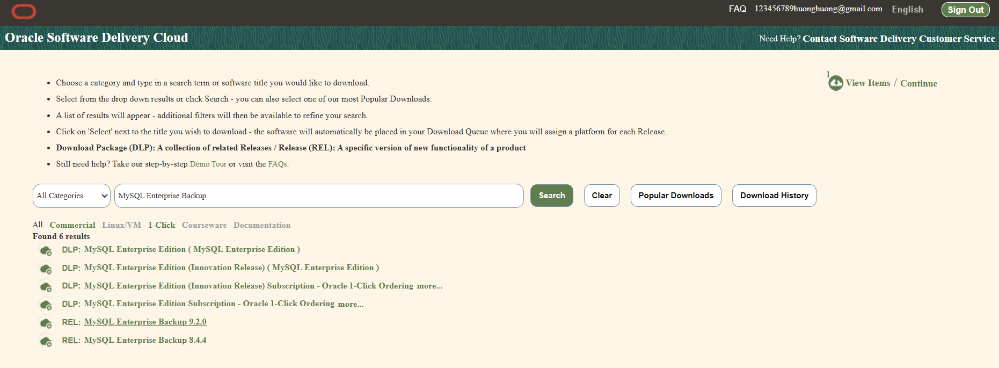

### MySqlBackup
> - MySQL Community có 1 hạn chế là chỉ có 1 công cụ backup là mysqldump. Công cụ này thì chỉ backup database ở cấp độ logical (backup database ra thành 1 file có nội dung là các câu lệnh SQL để khôi phục lại nguyên trạng database). Nó không có các tùy chọn backup như incremental hay apply binlog.
> - Tuy nhiên, ở phiên bản MySQL Enterprise lại có công cụ mysqlbackup có thể đáp ứng các nhu cầu backup database của DBA. Công cụ này cho phép download và sử dụng được cho bản Community.

- Tải file cài đặt từ trang https://edelivery.oracle.com
  - Tìm kiếm từ khóa **MySQL Enterprise Backup** và chọn **Add**
    <div align="center">
     
    </div>
   -  Tại mục **Continue** chọn hệ điều hành máy chủ
     <div align="center">
     
    </div>
- Upload file cài đặt lên máy chủ
    
   ```bash
       scp "/mnt/c/Users/Lenovo iDeapad/Downloads/V1047861-01.zip" root@14.225.69.27:/root/
   ```
   <div align="center">
     
    </div>
- Giải nén và khởi chạy
   ```bash
  * Giải nén: unzip V1047861-01.zip
  * Install: [root@labmysql ~]# rpm -Uvh mysql-commercial-backup-8.4.4-1.1.el7.x86_64.rpm
  			Preparing...                          ################################# [100%]
  			Updating / installing...
  			   1:mysql-commercial-backup-8.4.4-1.1################################# [100%]
   ```
- Backup MySQL với Mysqlbackup
 1. Backup Full
  ```bash
  	mysqlbackup --port=3306 --protocol=tcp --user=root --password=123123aA@ --with-timestamp --backup-dir=/backup/full backup
  ```
  - Ý nghĩa các tham số:

  	– port: Chỉ ra port mà MySQL đang sử dụng.
  
  	– protocol: Chỉ ra giao thức mà MySQL đang sử dụng.
  
  	– user: User sử dụng để backup (có thể là root)
  
  	– password: Mật khẩu của user backup.
  
  	– backup-dir: Chỉ ra đường dẫn đến thư mục lưu bản backup
  
  	– with-timestamp: Tạo ra thư mục lưu bản backup với tên là thời gian bản backup được tạo ra
  - Kết quả

  2. Backup Incremental

  

    
