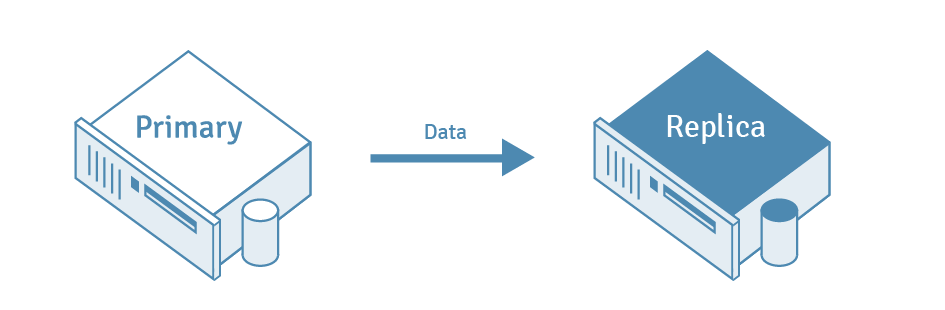

# PostgreSql

PostgreSQL là một hệ thống cơ sở dữ liệu quan hệ đối tượng mã nguồn mở mạnh mẽ sử dụng và mở rộng ngôn ngữ SQL kết hợp với nhiều tính năng lưu trữ và mở rộng an toàn các khối lượng công việc dữ liệu phức tạp nhất. Nguồn gốc của PostgreSQL có từ năm 1986 như một phần của dự án POSTGRES tại Đại học California, Berkeley và có hơn 35 năm phát triển tích cực trên nền tảng cốt lõi.

PostgreSQL đã tạo dựng được danh tiếng vững chắc nhờ kiến ​​trúc đã được chứng minh, độ tin cậy, tính toàn vẹn của dữ liệu, bộ tính năng mạnh mẽ, khả năng mở rộng và sự tận tụy của cộng đồng nguồn mở đằng sau phần mềm để liên tục cung cấp các giải pháp hiệu suất cao và sáng tạo. PostgreSQL chạy trên tất cả các hệ điều hành chính , tuân thủ ACID kể từ năm 2001 và có các tiện ích bổ sung mạnh mẽ như trình mở rộng cơ sở dữ liệu không gian địa lý PostGIS phổ biến. PostgreSQL đã trở thành cơ sở dữ liệu quan hệ nguồn mở được nhiều người và tổ chức lựa chọn.

___
## Tính năng có trong PostgreSQL

PostgreSQL đi kèm với nhiều tính năng nhằm giúp các nhà phát triển xây dựng ứng dụng, quản trị viên bảo vệ tính toàn vẹn của dữ liệu và xây dựng môi trường chịu lỗi, đồng thời giúp quản lý dữ liệu bất kể tập dữ liệu lớn hay nhỏ. Ngoài việc miễn phí và mã nguồn mở , PostgreSQL còn có khả năng mở rộng cao. Ví dụ có thể định nghĩa kiểu dữ liệu của riêng mình, xây dựng các hàm tùy chỉnh, thậm chí viết mã từ các ngôn ngữ lập trình khác nhau mà không cần biên dịch lại cơ sở dữ liệu.

PostgreSQL cố gắng tuân thủ tiêu chuẩn SQL khi sự tuân thủ đó không mâu thuẫn với các tính năng truyền thống hoặc có thể dẫn đến các quyết định kém về mặt kiến ​​trúc. Nhiều tính năng theo yêu cầu của tiêu chuẩn SQL được hỗ trợ, mặc dù đôi khi có cú pháp hoặc chức năng hơi khác nhau. Các tính năng khác nhau có trong PostgreSQL: 

- Kiểu dữ liệu
  * Primitives: Integer, Numeric, String, Boolean
  * Structured: Date/Time, Array, Range / Multirange, UUID
  * Document: JSON/JSONB, XML, Key-value (Hstore)
  * Geometry: Point, Line, Circle, Polygon
- Tính toàn vẹn dữ liệu
   * UNIQUE, NOT NULL
   * Primary Keys
   * Foreign Keys
   * Exclusion Constraints
   * Explicit Locks, Advisory Locks
- Tính đồng thời, hiệu năng
   * Indexing: B-tree, Multicolumn, Expressions, Partial
   * Advanced Indexing: GiST, SP-Gist, KNN Gist, GIN, BRIN, Covering indexes, Bloom filters
   * Sophisticated query planner / optimizer, index-only scans, multicolumn statistics
   * Transactions, Nested Transactions (via savepoints)
   * Multi-Version concurrency Control (MVCC)
   * Parallelization of read queries and building B-tree indexes
   * Table partitioning
   * All transaction isolation levels defined in the SQL standard, including Serializable
   * Just-in-time (JIT) compilation of expressions
- Reliability, Disaster Recovery
   * Write-ahead Logging (WAL)
   * Replication: Asynchronous, Synchronous, Logical
   * Point-in-time-recovery (PITR), active standbys
   * Tablespaces
- Security
   * Authentication: GSSAPI, SSPI, LDAP, SCRAM-SHA-256, Certificate, and more
   * Robust access-control system
   * Column and row-level security
   * Multi-factor authentication with certificates and an additional method
- Khả năng mở rộng
   * Stored functions and procedures
   * Procedural Languages: PL/pgSQL, Perl, Python, and Tcl. There are other languages available through extensions, e.g. Java, JavaScript (V8), R, Lua, and Rust
   * SQL/JSON constructors, query functions, path expressions, and JSON_TABLE
   * Foreign data wrappers: connect to other databases or streams with a standard SQL interface
   * Customizable storage interface for tables
   * Many extensions that provide additional functionality, including PostGIS
- Internationalisation, Text Search
   * Support for international character sets, e.g. through ICU collations
   * Case-insensitive and accent-insensitive collations
   * Full-text search

Ngoài ra, PostgreSQL có khả năng mở rộng cao: nhiều tính năng, chẳng hạn như chỉ mục, có API được xác định có thể xây dựng với PostgreSQL để giải quyết các thách thức của mình.

PostgreSQL đã được chứng minh là có khả năng mở rộng cao cả về số lượng dữ liệu mà nó có thể quản lý và số lượng người dùng đồng thời mà nó có thể đáp ứng. Có các cụm PostgreSQL đang hoạt động trong môi trường sản xuất quản lý nhiều terabyte dữ liệu và các hệ thống chuyên biệt quản lý petabyte.

___

## PostgreSQL Replication và Automatic Failover Tutorial

### PostgreSQL Replication 

Quá trình sao chép dữ liệu từ máy chủ cơ sở dữ liệu PostgreSQL sang máy chủ khác được gọi là PostgreSQL Replication. Máy chủ cơ sở dữ liệu nguồn thường được gọi là máy chủ Master , trong khi máy chủ cơ sở dữ liệu nhận dữ liệu đã sao chép được gọi là máy chủ Replica .

 

  
 

### Automatic Failover 

Sau khi sao chép luồng vật lý đã được thiết lập và cấu hình trong PostgreSQL, quá trình chuyển đổi dự phòng có thể diễn ra nếu máy chủ chính cho cơ sở dữ liệu bị lỗi. Chuyển đổi dự phòng là thuật ngữ mô tả quá trình khôi phục, trong PostgreSQL, có thể mất một thời gian , đặc biệt là vì bản thân PostgreSQL không cung cấp các công cụ tích hợp để phát hiện lỗi máy chủ. May mắn thay, có các công cụ cho phép Chuyển đổi dự phòng tự động, có thể giúp phát hiện lỗi và tự động chuyển sang chế độ chờ, giảm thiểu thời gian ngừng hoạt động của cơ sở dữ liệu. 

EnterpriseDB EDB Postgres Failover Manager cho phép bạn tự động phát hiện lỗi cơ sở dữ liệu và nâng cấp máy chủ dự phòng mới nhất thành máy chủ chính mới, giúp tránh thời gian ngừng hoạt động tốn kém của cơ sở dữ liệu. EDB Failover Manager thậm chí còn cung cấp khả năng phát hiện lỗi nhanh chóng và tự động . 

### High Availability và Failover Replication

Tính khả dụng cao đề cập đến các hệ thống cơ sở dữ liệu được thiết lập để các máy chủ dự phòng có thể tiếp quản nhanh chóng khi máy chủ chính hoặc máy chủ chính bị lỗi. Để đạt được tính khả dụng cao, một hệ thống cơ sở dữ liệu phải đáp ứng một số yêu cầu chính : hệ thống phải có dự phòng để ngăn ngừa các điểm lỗi đơn lẻ, cơ chế chuyển đổi đáng tin cậy và giám sát chủ động để phát hiện bất kỳ lỗi nào có thể xảy ra. Thiết lập sao chép dự phòng cung cấp tính dự phòng cần thiết để cho phép tính khả dụng cao bằng cách đảm bảo rằng các máy chủ dự phòng có sẵn nếu máy chủ chính hoặc máy chủ chính bị hỏng. 

___

