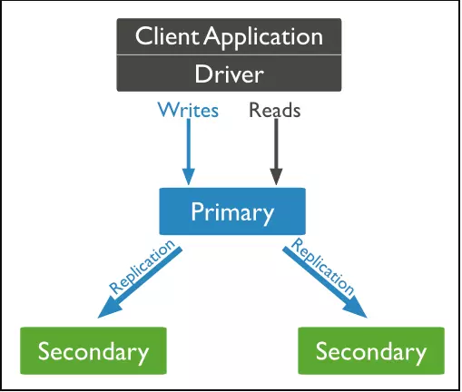

## Mô Hình Replica Set

>Replica Set là một nhóm các MongoDB server làm việc cùng nhau để đảm bảo tính sẵn có và độ tin cậy của dữ liệu. Mô hình này cung cấp khả năng tự động sao chép và phục hồi dữ liệu, giúp bảo vệ dữ liệu khỏi mất mát và tăng cường hiệu suất.

### a) Cấu Trúc Của Replica Set

Một Replica Set bao gồm:

- **Primary Node**: Là node chính, nơi thực hiện các thao tác ghi dữ liệu. Tất cả các thay đổi được thực hiện trên Primary sẽ được sao chép đến các Secondary Nodes.
- **Secondary Nodes**: Là các node phụ, sao chép dữ liệu từ Primary. Chúng có thể xử lý các truy vấn đọc, giúp giảm tải cho Primary và tham gia vào quá trình bầu chọn nếu Primary gặp sự cố.
- **Arbiter (nếu cần)**: Là node không chứa bản sao của dữ liệu nhưng tham gia vào quá trình bầu chọn để xác định Primary Node. Arbiter thường được sử dụng trong các Replica Set có số lượng node lẻ để duy trì tính nhất quán.

 

  
 <h4>Mô tả mô hình Replica Set</h4>
 

Ngoài ra, các thành viên trong Replica Set chia thành hai phần:
- **Voting members**: Các node tham gia bầu chọn (tối đa 7 node có quyền biểu quyết).
- **Non-voting members**: Các node không tham gia bầu chọn nhưng vẫn sao chép dữ liệu từ Primary, dùng để dự phòng hoặc cân bằng tải.

### b) Lợi Ích Từ Tính Năng Của Replica Set

- **Tự động failover**: Khi Primary gặp sự cố, Replica Set tự động bầu chọn một Secondary làm Primary mới mà không cần can thiệp thủ công.
- **Tự động khôi phục**: Khi một node gặp lỗi và quay trở lại hệ thống, nó tự động đồng bộ hóa dữ liệu với Primary mà không cần phục hồi thủ công.
- **Cân bằng tải**: Các truy vấn đọc có thể được phân phối giữa Primary và Secondary, giúp giảm tải cho node chính.
- **Tính nhất quán dữ liệu**: Replica Set hỗ trợ mô hình nhất quán *Eventually Consistent*, nghĩa là dữ liệu ghi vào Primary sẽ dần được sao chép sang các Secondary theo thời gian.

### c) Quá Trình Hoạt Động Của Replica Set

Khi Primary Node không còn khả năng hoạt động, Replica Set sẽ thực hiện một quy trình bầu chọn để chọn ra một Secondary Node mới làm Primary. Quá trình này dựa trên các tiêu chí như:

- Số lượng vote từ các node.
- Tình trạng của các node (có đang hoạt động hay không).
- Thời gian hoạt động liên tục (uptime).

#### Các Bước Trong Quá Trình Hoạt Động:
1. **Khởi tạo**: Một Replica Set bắt đầu với một node được chỉ định làm Primary, các node khác trở thành Secondary.
2. **Ghi dữ liệu**: Tất cả thao tác ghi diễn ra trên Primary Node. Dữ liệu được ghi vào oplog.
3. **Sao chép**: Các Secondary Nodes theo dõi oplog và sao chép các thay đổi để đồng bộ dữ liệu.
4. **Bầu chọn**: Nếu Primary gặp sự cố, các Secondary sẽ bầu chọn node mới làm Primary.
5. **Truy vấn**: Ghi dữ liệu chỉ trên Primary; đọc có thể từ cả Primary và Secondary để giảm tải.
6. **Khôi phục**: Nếu Secondary không đồng bộ, nó sẽ tự động khôi phục dữ liệu từ Primary.
