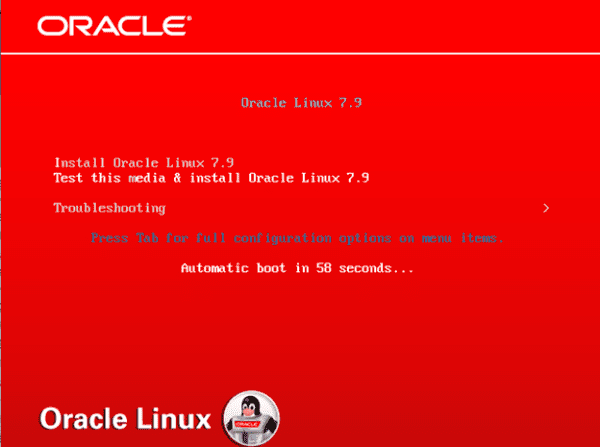
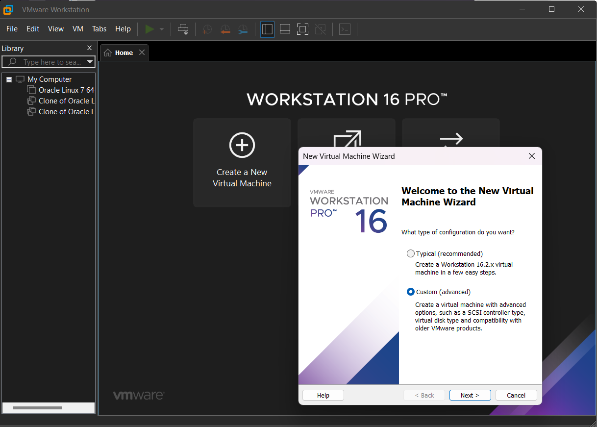
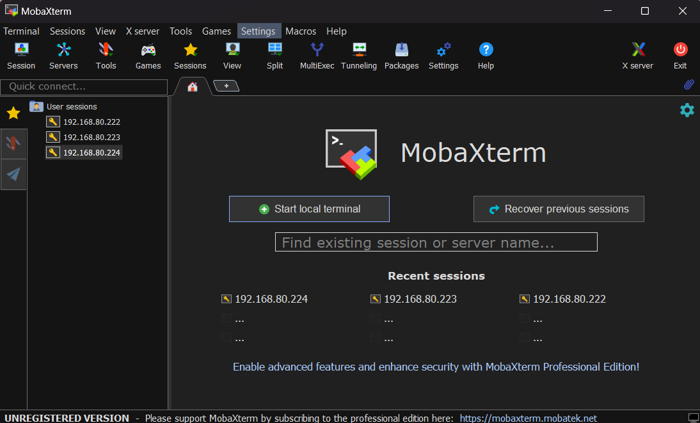

## Cài đặt MongoDB và Replica Set
### a) Môi trường cài đặt 
- **Hệ điều hành**: Oracle Linux 7.9
 

  
 <h4>Mô hình hoạt động của MongoDB</h4>
 

" />
 

- **Công cụ**: VMware Workstation Pro, MobaXterm

  <table>
    <tr>
      <td>
        
      </td>
      <td>
        
      </td>
    </tr>
  </table>

- **Phiên bản MongoDB**: 7.0.14

#### Thiết lập môi trường 3 máy ảo để cấu hình Replica Set:
- **Máy ảo 1 (Primary)**: IP `192.168.80.222`
- **Máy ảo 2 (Secondary)**: IP `192.168.80.223`
- **Máy ảo 3 (Secondary)**: IP `192.168.80.224`

Sử dụng công cụ **MobaXterm** với **SSH** để truy cập command line của từng máy ảo.

- **Cấu hình ổ đĩa dữ liệu MongoDB**: 
  - Đường dẫn `dbPath` là `/data/datafile` cho cả 3 máy ảo.
### b) Quá trình cài đặt  
