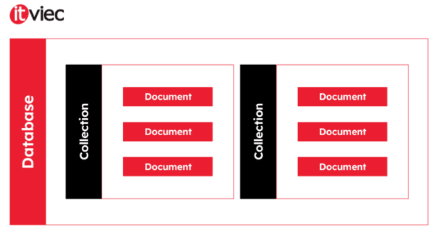

# Tổng Quan về MongoDB

MongoDB là một loại cơ sở dữ liệu **linh hoạt**, cho phép người dùng **lưu trữ dữ liệu** một cách **đơn giản** và **hiệu quả**. Thay vì sử dụng bảng (table) như trong các cơ sở dữ liệu truyền thống, MongoDB sử dụng các khái niệm như **Collection** và **Document**, để quản trị cơ sở dữ liệu **NoSQL**.

- **NoSQL** (*Not only SQL*): Được sử dụng thay thế cho cơ sở dữ liệu quan hệ truyền thống (Relational Database - RDB). NoSQL rất hữu ích khi làm việc với các tập dữ liệu lớn và phân tán.
- MongoDB là một công cụ quản lý thông tin theo hướng **document**, có khả năng lưu trữ và truy xuất dữ liệu hiệu quả.

Trong khi đó, **SQL** (*Structured Query Language*) là ngôn ngữ lập trình tiêu chuẩn dùng để quản lý các cơ sở dữ liệu **quan hệ**. Dữ liệu trong SQL được chuẩn hóa dưới dạng **schema** và **table**, với cấu trúc cố định.

## Ưu điểm của MongoDB

- **Tính linh hoạt**: MongoDB là hệ thống cơ sở dữ liệu **phi quan hệ**, cung cấp khả năng lưu trữ dữ liệu mà không cần tuân theo một mô hình quan hệ cụ thể.
- **Khả năng mở rộng**: Nhờ tính năng **sharding**, MongoDB cho phép phân chia dữ liệu thành nhiều phần và lưu trữ trên nhiều máy chủ.
- **Tốc độ truy xuất nhanh**: MongoDB có thể đáp ứng các yêu cầu truy vấn dữ liệu trong thời gian ngắn hơn so với các hệ thống cơ sở dữ liệu quan hệ truyền thống.
- **Tính khả dụng cao**: MongoDB hỗ trợ **sao lưu** và **phục hồi dữ liệu**, giúp bảo vệ dữ liệu khỏi rủi ro.
- **Dễ sử dụng**: MongoDB cung cấp các công cụ quản lý dữ liệu trực quan và dễ sử dụng, tối ưu hóa hiệu suất.
- **Dễ dàng tích hợp với Big Data**: MongoDB dễ dàng tích hợp với các hệ thống Big Data như **Hadoop**.

## Nhược điểm của MongoDB

- **Yêu cầu bộ nhớ cao**: Cần nhiều bộ nhớ để lưu trữ dữ liệu (*data storage*).
- **Giới hạn dung lượng tài liệu**: Không thể lưu trữ các tài liệu lớn hơn 16MB.
- **Hạn chế về Data Nesting**: BSON không cho phép nested data quá 100 cấp độ.

---

## a) Các Khái Niệm

### Khái Niệm Database
> **Database** là nơi lưu trữ các **Collection**. Mỗi cơ sở dữ liệu sẽ có một tập hợp các tệp riêng biệt trên máy chủ. Một máy chủ MongoDB có thể chứa nhiều cơ sở dữ liệu khác nhau.

### Khái Niệm Collection
> **Collection** là nhóm các **Document**. Tương tự như bảng (table) trong các hệ quản trị cơ sở dữ liệu khác. Một Collection thuộc về một cơ sở dữ liệu duy nhất và không có ràng buộc quan hệ như các hệ thống truyền thống, giúp việc truy xuất dữ liệu nhanh chóng. Trong một Collection, có thể lưu trữ nhiều loại dữ liệu khác nhau, không giống như các bảng cố định trong MySQL.

### Khái Niệm Document
> **Document** là đơn vị cơ bản trong MongoDB, có cấu trúc tương tự như **JSON**. Nó được tạo thành từ các cặp **key-value**. Document trong cùng một Collection không cần phải giống nhau về cấu trúc hay các trường dữ liệu. Điều này có nghĩa là mỗi Document có thể có các trường khác nhau và kiểu dữ liệu khác nhau.

<div align="center">

| &nbsp;&nbsp;&nbsp;&nbsp;RDBMS&nbsp;&nbsp;&nbsp;&nbsp; |&nbsp;&nbsp;&nbsp;&nbsp;MongoDB&nbsp;&nbsp;&nbsp;&nbsp;|
| --- | --- |
| Database | Database |
| Table | Collection |
| Row | Document |
| Column | Field |

<h4>Mối liên hệ giữa RDBMS và MongoDB</h4> 

</div>

 <div align="center">
  
 <h4>Mô hình hoạt động của MongoDB</h4>
 </div>
 
*MongoDB có nhiều ưu điểm như khả năng lưu trữ dữ liệu phân tán, linh hoạt trong cấu trúc dữ liệu, có thể mở rộng, tốc độ truy vấn nhanh và hỗ trợ các tính năng như **indexing**, **replication**, **sharding** và **map-reduce**.*

### Indexing (chỉ mục)
>Indexing trong MongoDB giúp tăng tốc độ truy vấn dữ liệu bằng cách tạo các chỉ mục trên các trường của document. Chỉ mục trong MongoDB hoạt động tương tự như chỉ mục trong sách, giúp việc tìm kiếm thông tin diễn ra nhanh chóng mà không cần phải quét toàn bộ bộ sưu tập (collection).
#### Các loại chỉ mục trong MongoDB:

- **Single Field Index**: Chỉ mục trên một trường duy nhất. 
  - Ví dụ, chỉ mục trên trường `name`:
    ```javascript
    db.collection.createIndex({ name: 1 })
    ```
  *1 chỉ ra rằng chỉ mục được sắp xếp theo thứ tự tăng dần.*

- **Compound Index**: Chỉ mục trên nhiều trường. 
  - Ví dụ, chỉ mục trên cả `name` và `age`:
    ```javascript
    db.collection.createIndex({ name: 1, age: -1 })
    ```
  *Chỉ mục trên `name` sắp xếp tăng dần và `age` sắp xếp giảm dần.*

- **Multikey Index**: Được sử dụng khi trường là một mảng. MongoDB tạo chỉ mục trên từng phần tử trong mảng.

- **Text Index**: Dành cho các trường văn bản để hỗ trợ tìm kiếm văn bản toàn văn (full-text search).

- **Hashed Index**: Dùng để tạo chỉ mục hash trên một trường, giúp phân tán đồng đều các giá trị. Thường được sử dụng trong **Sharding**.

**Ghi chú**:
>- Các chỉ mục giúp tối ưu hóa hiệu suất truy vấn, nhưng cũng làm tăng thời gian ghi dữ liệu và tiêu tốn thêm bộ nhớ. Do đó, cần cân nhắc kỹ lưỡng khi tạo chỉ mục.
>- Việc chọn loại chỉ mục phù hợp phụ thuộc vào kiểu truy vấn và cấu trúc dữ liệu của ứng dụng.

### Replication
>Replication là tính năng giúp sao chép dữ liệu từ một MongoDB node (Primary) sang nhiều node khác (Secondary). Mục đích chính của replication là cung cấp khả năng dự phòng, tính sẵn sàng cao và phục hồi sau thảm họa.
#### Các thành phần của Replication:
- **Primary**: Là node chính, nơi tất cả các thao tác ghi (write operations) xảy ra.
- **Secondary**: Sao chép dữ liệu từ Primary qua Oplog (Operation Log) và cập nhật dữ liệu theo thời gian thực. Secondary có thể xử lý các yêu cầu đọc nếu được cấu hình.
- **Arbiter**: Một node đặc biệt chỉ tham gia vào quá trình bầu chọn Primary khi có sự cố, nhưng không lưu trữ dữ liệu.
#### Lợi ích của Replication:
- *Tính dự phòng (Fault tolerance)*: Nếu Primary gặp sự cố, một trong các Secondary sẽ được bầu làm Primary mới để tiếp tục xử lý các yêu cầu.

- *Tăng tính sẵn sàng (High availability)*: Dữ liệu luôn có sẵn, ngay cả khi một hoặc nhiều node bị lỗi.

- *Cân bằng tải cho đọc (Read scaling)*: Có thể cấu hình cho phép các Secondary xử lý các yêu cầu đọc, giúp giảm tải cho Primary.

### Sharding 
>Sharding là kỹ thuật giúp chia nhỏ dữ liệu (shards) và phân tán trên nhiều máy chủ (server) để tăng cường khả năng mở rộng (scalability) của cơ sở dữ liệu. Sharding được sử dụng để mở rộng hệ thống khi dữ liệu quá lớn và không thể lưu trữ hoặc xử lý trên một máy chủ duy nhất.
#### Các thành phần của Sharding:
- **Shards**: Mỗi shard lưu trữ một phần dữ liệu của hệ thống. Một shard có thể là một Replica Set để tăng tính sẵn sàng và dự phòng.
- **Mongos**: Là router chịu trách nhiệm định tuyến các yêu cầu từ ứng dụng đến shard phù hợp.
- **Config Servers**: Lưu trữ metadata và thông tin cấu hình về sharded cluster.

**Cách hoạt động của Sharding**: Dữ liệu được phân mảnh dựa trên Sharding Key (một trường hoặc tập hợp các trường) và được phân phối trên nhiều shards khác nhau. Khi một truy vấn được gửi đến, Mongos sẽ định tuyến truy vấn đến shard chứa dữ liệu tương ứng.
   - Ví dụ:
```javascript
    db.collection.createIndex({ user_id: "hashed" })})
```
  *Trong trường hợp này, dữ liệu sẽ được chia theo giá trị hash của user_id và phân phối trên các shards.*

### Map-Reduce
>Map-Reduce là một mô hình lập trình được MongoDB hỗ trợ, sử dụng để xử lý và tổng hợp dữ liệu lớn bằng cách chia nhỏ các tác vụ phức tạp thành hai bước: Map và Reduce.
#### Cách hoạt động của Map-Reduce:
- *Map*: Lấy dữ liệu đầu vào và ánh xạ (map) nó thành một tập hợp các cặp khóa-giá trị.
- Hàm map xử lý từng document và trả về một cặp khóa-giá trị.
    Ví dụ: Trong bài toán tính tổng doanh thu theo tháng, map sẽ nhóm doanh thu theo từng tháng.
- Reduce: Sau khi tất cả các cặp khóa-giá trị được tạo, hàm reduce được áp dụng để tổng hợp và giảm các giá trị tương ứng với cùng một khóa.
Hàm reduce tổng hợp dữ liệu theo các cặp khóa-giá trị từ bước map.
-  Ví dụ về Map-Reduce trong MongoDB:
   ```javascript
    db.orders.mapReduce(
     function() {
       emit(this.customerId, this.total);
     },
     function(key, values) {
       return Array.sum(values);
     },
     {
       out: "total_orders_by_customer"
     }
   )
    ```

*Hàm trên sẽ tính tổng giá trị đơn hàng (total) của mỗi khách hàng (customerId).*
